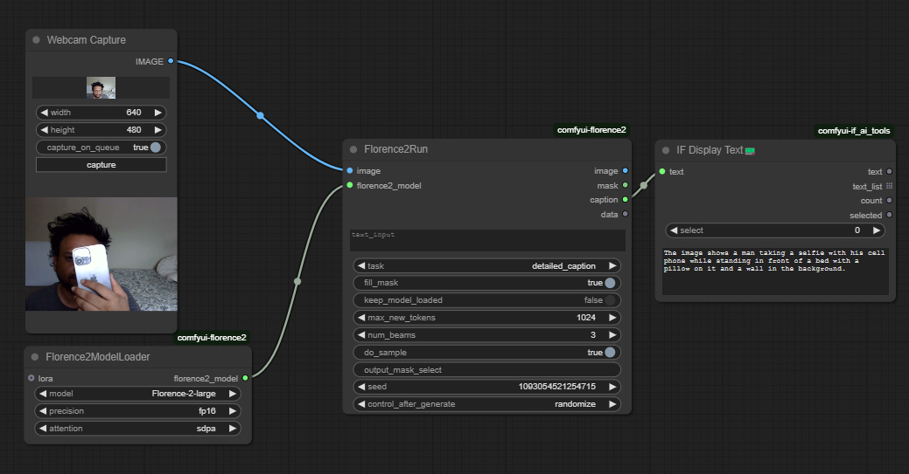

# Webcam-Florence-2-Large-Caption

**ComfyUI workflow for near real-time image captioning using Microsoft’s Florence 2 Large model.**  

This repository contains a ComfyUI workflow that connects your webcam feed to Microsoft’s [Florence-2-Large](https://huggingface.co/Microsoft/Florence-2-Large) captioning model. The pipeline demonstrates how to generate captions in near real-time using ComfyUI’s flexible node-based system. This prototype can serve as a starting point for live captioning applications, accessibility tools, and more advanced augmented reality (AR) or Large Language Model (LLM) integrations.



---

## Table of Contents
1. [Prototype Intent, Impact, Key Takeaways](#prototype-intent-impact-key-takeaways)
2. [Overview of the Workflow](#overview-of-the-workflow)
3. [Installation & Setup](#installation--setup)
4. [Usage](#usage)
5. [Workflow Explanation](#workflow-explanation)
6. [Acknowledgments](#acknowledgments)

---

## Prototype Intent, Impact, Key Takeaways

### Intent
Evaluate how Microsoft’s Florence-2-Large caption model ([Microsoft/Florence-2-Large · Hugging Face, 2025](https://huggingface.co/Microsoft/Florence-2-Large)) can generate near real-time captions from a webcam feed within [ComfyUI](https://github.com/comfyanonymous/ComfyUI). The focus is on exploring speed and caption quality for potential memory support and accessibility tools.

### Impact
Demonstrates a straightforward approach to live image captioning that:
- Can benefit **accessibility** (e.g., providing automated descriptive text of a video feed).
- Serves as a **building block** for more advanced AR and LLM integrations, potentially bridging live vision with textual or voice-based interfaces.

### Key Takeaway
Florence-2-Large provides high-quality captions with minimal setup in ComfyUI. However, additional steps are needed to seamlessly integrate AR capabilities or connect these captions to larger language models for more interactive experiences (e.g., question-answering about live video content).

---

## Overview of the Workflow

This ComfyUI workflow consists of four main nodes:

1. **WebcamCapture**  
   Captures live image frames from your webcam and streams them into ComfyUI.

2. **Florence2ModelLoader**  
   Loads Microsoft’s Florence 2 Large model (weights automatically downloaded from Hugging Face if not present).

3. **Florence2Run**  
   Receives image frames from the Webcam node, runs inference on them using the loaded Florence 2 model, and produces textual captions describing the live feed.

4. **IF_DisplayText**  
   Displays the resulting captions directly within ComfyUI for easy viewing and debugging.

A simplified diagram (based on the included `.json` file) looks like this:

```
[WebcamCapture] --> [Florence2Run (using Florence2ModelLoader)] --> [IF_DisplayText]
```

---

## Installation & Setup

1. **Clone or Download ComfyUI**  
   - [ComfyUI GitHub](https://github.com/comfyanonymous/ComfyUI)
   - Follow their instructions to install ComfyUI on your system (Windows, Linux, or Mac).

2. **Install Required Custom Nodes**  
   - [WebcamCapture node](https://github.com/<path-to-WebcamCapture>) (or the relevant ComfyUI plugin)  
   - [comfyui-florence2 repository](https://github.com/<path-to-comfyui-florence2>) for `Florence2ModelLoader` and `Florence2Run`.

3. **Start ComfyUI**  
   - Typically by running `python main.py` within the ComfyUI directory (or however you normally start ComfyUI).  

4. **Open the Workflow**  
   - In ComfyUI’s web UI, import the `.json` workflow (`Webcam-Florence-2-Large-Caption.json`).  
   - Confirm that you see four nodes: `WebcamCapture`, `Florence2ModelLoader`, `Florence2Run`, and `IF_DisplayText`.

5. **Verify Model Download**  
   - When the workflow is first used, it will attempt to download the Florence 2 Large checkpoint from Hugging Face. This may take some time depending on your connection.

---

## Usage

1. **Load the Workflow**  
   In ComfyUI, click on the **Load** or **Import** button and select the `Webcam-Florence-2-Large-Caption.json` file.  

2. **Enable the Webcam**  
   - Double-click the `WebcamCapture` node.  
   - Ensure “**Capture**” is enabled. Adjust resolution or other camera settings if necessary.

3. **Run the Workflow**  
   - Click the **Run** button at the top of the ComfyUI interface.  
   - You should see the webcam feed processed by Florence 2 Large, resulting in text captions displayed by the `IF_DisplayText` node.

4. **Observe the Output**  
   - The `IF_DisplayText` node displays the generated captions in near real-time.  
   - If needed, open the node to see the final text strings, or route them to other ComfyUI text-processing nodes.

---

## Workflow Explanation

Below is a more detailed breakdown of each node and its connections, corresponding to the included `.json` file:

1. **WebcamCapture**  
   - **ID 14** in the workflow.  
   - Captures live frames from your default webcam.  
   - Outputs an `IMAGE` stream that feeds into the next node.

2. **Florence2ModelLoader**  
   - **ID 11** in the workflow.  
   - Responsible for loading the Florence-2-Large checkpoint (automatic download from Hugging Face).  
   - Outputs a `florence2_model` object used by the `Florence2Run` node.

3. **Florence2Run**  
   - **ID 12** in the workflow.  
   - Receives the live images from `WebcamCapture` and the loaded model from `Florence2ModelLoader`.  
   - Outputs:
     - **image** (same image or processed image)
     - **mask** (not used here)
     - **caption** (the text describing the scene)
     - **data** (JSON metadata if needed)

4. **IF_DisplayText**  
   - **ID 13** in the workflow.  
   - Takes the `caption` output from `Florence2Run` and displays it on the ComfyUI interface.  
   - Allows quick visualization and debugging of the generated captions.

---

## Acknowledgments

- [**ComfyUI**](https://github.com/comfyanonymous/ComfyUI) by [comfyanonymous](https://github.com/comfyanonymous) for a powerful node-based interface.  
- [**Microsoft Florence-2-Large**](https://huggingface.co/Microsoft/Florence-2-Large) for providing a high-quality image captioning model.  
- [**WebcamCapture Node**](https://github.com/) and [**Florence2ModelLoader**](https://github.com/) custom nodes for enabling the capture and model loading functionality in ComfyUI.